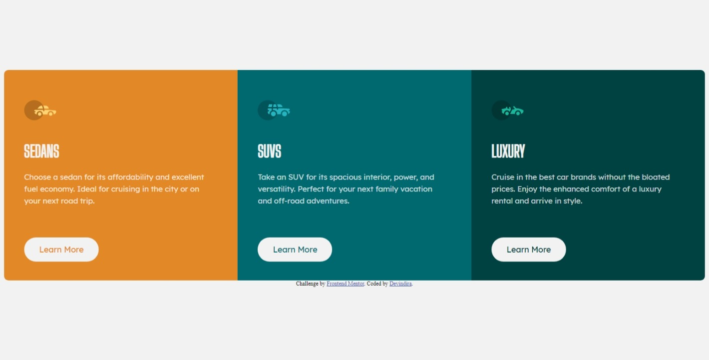

# Frontend Mentor - 3-column preview card component solution

This is a solution to the [3-column preview card component challenge on Frontend Mentor](https://www.frontendmentor.io/challenges/3column-preview-card-component-pH92eAR2-). Frontend Mentor challenges help you improve your coding skills by building realistic projects. 

## Table of contents

- [Overview](#overview)
  - [The challenge](#the-challenge)
  - [Screenshot](#screenshot)
  - [Links](#links)
- [My process](#my-process)
  - [Built with](#built-with)
  - [Useful resources](#useful-resources)
- [Author](#author)

## Overview

### The challenge

Users should be able to:

- View the optimal layout depending on their device's screen size
- See hover states for interactive elements

### Screenshot

### Links

- Solution URL: [Frontend mentor solution submission](https://www.frontendmentor.io/solutions/responsive-page-using-css-flexbox-FfodezBQI)
- Live Site URL: [Github pages - 3 column preview card](https://devxx01.github.io/3-column-preview-card/)

## My process

### Built with

- Semantic HTML5 markup
- CSS custom properties
- Flexbox
- Mobile-first workflow

### Useful resources

- [CSS Tutorial](https://www.w3schools.com/css/) - This helped me for learning more about CSS especially in styling the box.

## Author

- Frontend Mentor - [@devxx01](https://www.frontendmentor.io/profile/devxx01)
- Instagram - [@devinndira](https://www.instagram.com/devinndira/)

